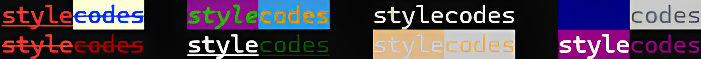

# stylecodes

`stylecodes` is a Go package that provides direct control over ANSI escape codes for terminal styling. Unlike higher-level styling libraries, stylecodes focuses on a lower-level interface, giving developers the ability to understand and explicitly work with ANSI escape codes, which affect the entire terminal and not just a single line of text.



## Why stylecodes?

While there are many libraries that provide terminal styling, they often abstract away the underlying ANSI escape codes, leaving developers unaware of their broader impact on the terminal. `stylecodes` provides:

- **Direct Control**: Allows developers to work with ANSI escape codes directly, providing clear and precise control over terminal output.
- **Transparent Interface**: Provides a transparent interface that helps developers learn and understand how ANSI escape codes work and their effect on the terminal.
- **Convenience**: Includes a `Style` function which wraps text in a style code and an end code.

## Installation

To install `stylecodes`, use go get:

```bash
go get github.com/avearmin/stylecodes
```

## Usage

### Basic Usage

To use `stylecodes`, you can directly use the provided constants for different styles. For example:

```go
package main

import (
    "fmt"
    codes "github.com/avearmin/stylecodes"
)

func main() {
    fmt.Println(codes.Color.Red + "This is red text" + codes.Color.Reset)
}
```

### Using Multiple Styles

```go
package main

import (
	"fmt"
	codes "github.com/avearmin/stylecodes"
)

func main() {
	fmt.Println(
		codes.Color.Black + codes.BgColor.BrightRed + codes.Modifier.Bold + codes.Modifier.Underline + "This is important" + codes.ResetAll
	)
}
```

### Using Multiple Styles With Fine Control Of Ending Styles

```go
package main

import (
	"fmt"
	codes "github.com/avearmin/stylecodes"
)

func main() {
	fmt.Println(codes.Color.Red + codes.Modifier.Bold + codes.Modifier.Underline + "This is red, bold, and underlined" + codes.Color.Reset + codes.Modifier.ResetBold)
	fmt.Println("but this is just underlined" + codes.Modifier.ResetUnderline)
}
```

### Using the Style Function

```go
package main

import (
    "fmt"
    codes "github.com/avearmin/stylecodes"
)

func main() {
    result := codes.Style("This is important!", codes.Color.Black, codes.BgColor.BrightRed, codes.Modifier.Bold, codes.Modifier.Underline)
    fmt.Println(result)
}
```

### Using Hex, RGB, and ANSI 256-Color Functions

```go
package main

import (
		"fmt"
		codes "github.com/avearmin/stylecodes"
)

func main() {
    // Using Hex color
    fmt.Println(codes.Color.Hex("#ff5733") + "Hello in Hex Color" + cdoes.Color.Reset)

    // Using RGB color
    fmt.Println(codes.Color.RGB(128, 0, 128) + "Hello in RGB Color" + codes.Color.Reset)

    // Using ANSI 256-Color mode
    fmt.Println(codes.Color.Ansi256(34) + "Hello in ANSI 256-Color" + codes.Color.Reset)

    // Using Hex color for background
    fmt.Println(codes.BgColor.Hex("#87ceeb") + "Hello with Hex Background" + codes.BgColor.Reset)

	// Using the Style function
	fmt.Println(codes.Style("Hello from Style() with Hex color", codes.Color.Hex("#ff5733")))
}
```
